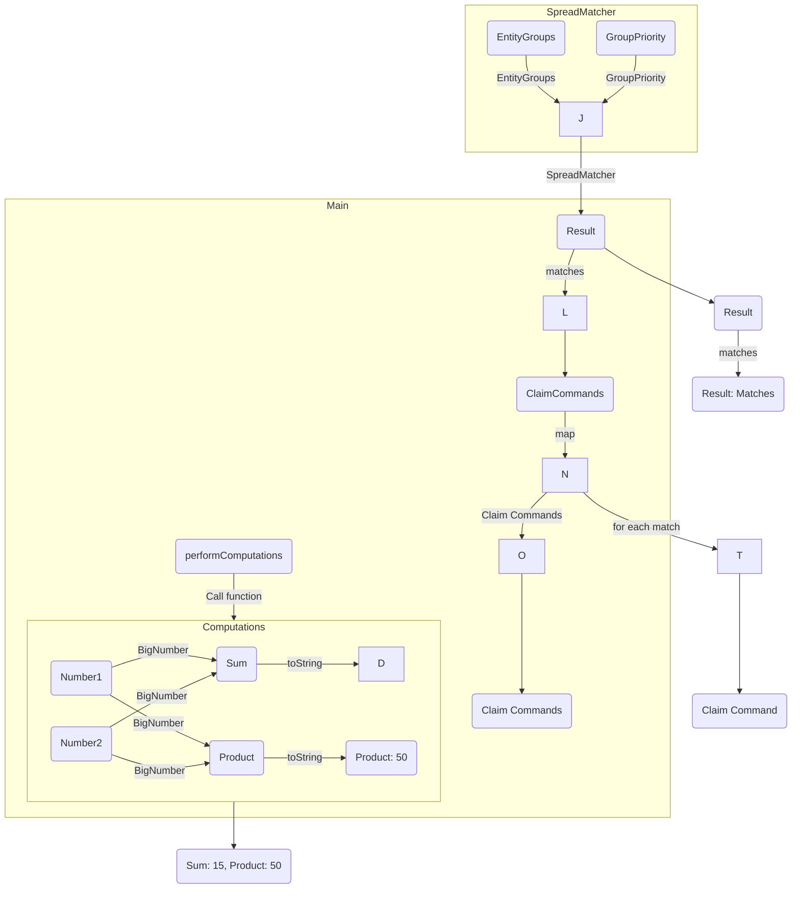

##Product Overview
- Energy Data Management: The SDK provides tools for securely storing, retrieving, and managing energy-related data, such as energy consumption, production, and certification information.

- Decentralized Energy Marketplaces: Developers can utilize the SDK to create decentralized energy marketplaces where energy producers and consumers can trade energy directly, bypassing intermediaries and enabling peer-to-peer energy transactions.

- Energy Certificate Tracking: The SDK facilitates the tracking and verification of energy certificates, ensuring the transparency and integrity of renewable energy claims and transactions.

- Smart Contract Interactions: Developers can interact with smart contracts deployed on the EWF platform using the SDK's APIs, making it easier to execute transactions, read data, and trigger contract events.

##Claim Diagram
The Claim Diagram illustrates the flow of computations and matching in a claim processing system. It consists of three main components: Computations, SpreadMatcher, and Main.

###SpreadMatcher
The SpreadMatcher component is responsible for matching entity groups based on their priorities. It receives input from the EntityGroups and GroupPriority entities and generates a Result based on the matches found.

###Computations
The Computations component performs various computations using the BigNumber library. It takes two input numbers, Number1 and Number2, and performs addition (Sum) and multiplication (Product) operations using the BigNumber library. The results are then converted to strings using the toString function.

###Main
The Main component orchestrates the overall claim processing flow. It calls the Computations component, passes the results to the SpreadMatcher component, and receives the matching Result. The Result is then processed in the ClaimCommands entity, where each match is mapped to a Claim Command. Finally, the generated Claim Commands are logged in the console.

The diagram depicts the flow of data and control between these components, indicating the direction of the flow and the operations performed at each step.

##Transfer Diagram
The following diagram illustrates the flow of code execution and interactions between different components in the provided code snippet.

```mermaid
graph TD;

subgraph EnergyTransferRequest
    A(createEtr) -->|attrs| B(EnergyTransferRequest.fromAttrs)
    B --> C(etr)
    C -->|toAttrs| D(etr.toAttrs)
    D -->|state| E(Console.log)
    E --> F(etr.issuanceStarted)
    F -->|state| G(Console.log)
    G --> H(etr.issuanceFinished)
    H -->|state| I(Console.log)
    I --> J(etr.certificateId)
    J --> K(etr.persisted)
    K -->|state| L(Console.log)
    L --> M(etr.startValidation)
    M -->|state| N(Console.log)
    N --> O(etr.updateValidationStatus)
    O -->|state| P(Console.log)
    P --> Q(etr.transferStarted)
    Q -->|state| R(Console.log)
    R --> S(etr.transferFinished)
    S -->|state| T(Console.log)
end

subgraph BigNumber
    U(Number1) -->|BigNumber| V(BigNumber.from)
    V --> W(number1)
    W -->|add| X(sum)
    W -->|mul| Y(product)
    X --> Z(Console.log)
    Y --> AA(Console.log)
end

subgraph ClaimCommands
    AB(claimCommands) --> AC(Console.log)
    AC --> AD(Console.log)
end

subgraph ExecutionController
    AE(performEnergyTransferComputations) --> EnergyTransferRequest
    AE --> AF(performBigNumberComputations)
    AE --> AG(claimCommands)
    AF --> BigNumber
    AG -->ClaimCommands
    AG --> AH(Console.log)
end

AE --> AI(construct TestClass)
AI --> AJ(run)
```

This diagram showcases the sequence of operations and interactions among different components in the code. The key components are:

- EnergyTransferRequest: Represents the energy transfer request entity and its state transitions. It includes functions for starting and finishing the issuance, updating validation status, and starting and finishing the transfer.

- BigNumber: Handles computations involving large numbers. It performs addition and multiplication operations.

- ClaimCommands: Constructs claim command objects with specific data values.

- ExecutionController: Serves as the main class that orchestrates the execution flow. It calls functions to perform energy transfer computations, big number computations, and generate claim commands. The results are logged using console.log().

Please note that this diagram provides a high-level overview of the code flow, focusing on the major interactions. It may not capture all the internal details or implementation specifics.