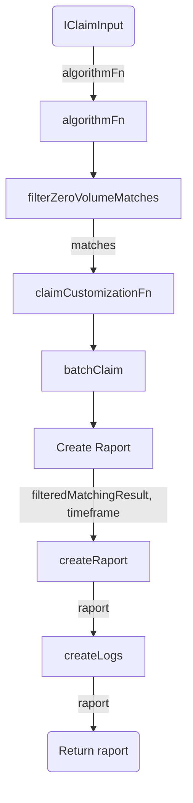
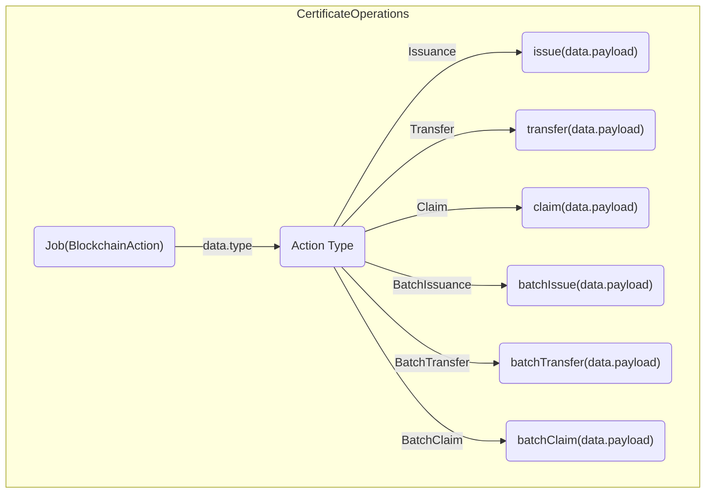
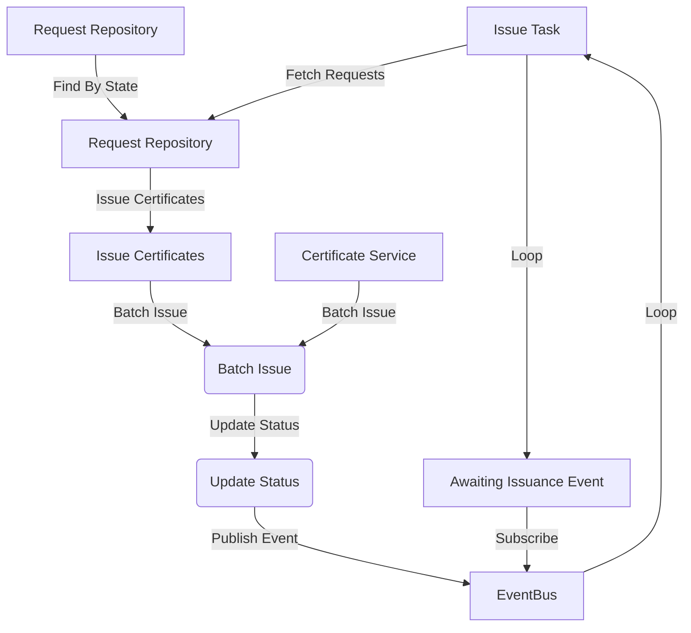

## Prerequisites
Before running the script, ensure that you have the following prerequisites:

- The modules in EWF-24/7 SDK has been already built

- TypeScript: Install TypeScript globally on your system.

- ts-node: Install ts-node globally on your system. It allows executing TypeScript files directly without the need for compilation.

- Python: Install Python globally on your system

####To run this script type 
```python
python run_computation.py
```


## Product Overview
- Energy Data Management: The SDK provides tools for securely storing, retrieving, and managing energy-related data, such as energy consumption, production, and certification information.

- Decentralized Energy Marketplaces: Developers can utilize the SDK to create decentralized energy marketplaces where energy producers and consumers can trade energy directly, bypassing intermediaries and enabling peer-to-peer energy transactions.

- Energy Certificate Tracking: The SDK facilitates the tracking and verification of energy certificates, ensuring the transparency and integrity of renewable energy claims and transactions.

- Smart Contract Interactions: Developers can interact with smart contracts deployed on the EWF platform using the SDK's APIs, making it easier to execute transactions, read data, and trigger contract events.

### Origin 24/7 SDK Claim Package
- Origin 24/7 SDK that provides functionality for matching energy generation with consumption and claiming certificates on the blockchain. It also includes features for storing matching results.

- The package offers a ClaimFacade that can be injected into your service to perform matching and retrieve matching results. You can customize the claiming process by providing a matching algorithm and a customization function.

- To use this package, you need a Nest.js application and a configured TypeORM setup. After installing the package, you import the ClaimModule into your application and add the module's entities to the TypeORM configuration.




### Origin 24/7 SDK Certificate Package
- The Origin 24/7 SDK's Certificate module allows for the deployment of contracts, issuance, transfer, and claiming of certificates. It handles transaction batching and enqueuing for optimal blockchain performance.

- The module provides an off-chain implementation that stores data in a local database and synchronizes it with the blockchain upon request. This allows for immediate changes and flexibility in synchronization.

- The Origin 24/7 SDK's Certificate module provides functionality for on-chain operations such as deploying contracts, issuing, transferring, and claiming certificates on the blockchain.



### Origin 24/7 SDK Transfer Package
- The Origin 24/7 SDK Transfer module enables the issuance and transfer of energy certificates on the blockchain.

- The Transfer module integrates with Nest.js applications and requires TypeORM configuration.

- Users can send generation events to the CQRS event bus, implement transfer site queries, and add validators for transfer validation.


- Fetch Energy Transfer Requests from the E- nergyTransferRequestRepository.
- Issue Certificates based on the fetched requests.
- Perform a batch issue of the certificates using the OffChainCertificateService.
- Update the status of the Energy Transfer Requests.
- Publish an AwaitingIssuanceEvent using the EventBus.
- Repeat the above steps in a loop for continuous processing.

The diagram depicts the flow of data and control between these components, indicating the direction of the flow and the operations performed at each step.


## Transfer Diagram
The following diagram illustrates the flow of code execution and interactions between different components in the provided code snippet.

```mermaid
graph TD;

subgraph EnergyTransferRequest
    A(createEtr) -->|attrs| B(EnergyTransferRequest.fromAttrs)
    B --> C(etr)
    C -->|toAttrs| D(etr.toAttrs)
    D -->|state| E(etr.issuanceStarted)
    E -->|state| F(etr.issuanceFinished)
    F -->|state| G(etr.certificateId)
    G -->|state| H(etr.persisted)
    H -->|state| I(etr.startValidation)
    I -->|state| J(etr.updateValidationStatus)
    J -->|state| K(etr.transferStarted)
    K -->|state| L(etr.transferFinished)
end;

```



- The createEtr function takes in attributes and creates an EnergyTransferRequest.
- The EnergyTransferRequest instance is then processed to extract toAttrs.
- The state of the EnergyTransferRequest is logged as issuanceStarted, indicating the start of the issuance process. Once the issuance is finished, the state is logged as issuanceFinished.
- The certificate ID associated with the EnergyTransferRequest is logged.
- The EnergyTransferRequest is marked as persisted.
- The start validation process is initiated for the EnergyTransferRequest.
- The validation status is updated for the EnergyTransferRequest.
- The transfer process is started for the EnergyTransferRequest.
- Finally, the transfer is marked as finished for the EnergyTransferRequest.

This diagram showcases the sequence of operations and interactions among different components in the code. The key components are:

- EnergyTransferRequest: Represents the energy transfer request entity and its state transitions. It includes functions for starting and finishing the issuance, updating validation status, and starting and finishing the transfer.

- BigNumber: Handles computations involving large numbers. It performs addition and multiplication operations.

- ClaimCommands: Constructs claim command objects with specific data values.

- ExecutionController: Serves as the main class that orchestrates the execution flow. It calls functions to perform energy transfer computations, big number computations, and generate claim commands. The results are logged using console.log().

Please note that this diagram provides a high-level overview of the code flow, focusing on the major interactions. It may not capture all the internal details or implementation specifics.


## Technologies in Energy Web 24/7 SDK

### TYPEORM
- TypeORM is an Object-Relational Mapping (ORM) library for TypeScript and JavaScript.

- It allows you to work with databases using object-oriented programming principles, where database tables are represented as classes and database records are represented as objects.

- TypeORM supports various database systems such as MySQL, PostgreSQL, SQLite, and more.

- It provides a powerful set of features including entity modeling, querying, data manipulation, and database migrations.

### NestJS
- Nest.js is a progressive Node.js framework for building scalable and efficient server-side applications.

- It follows the modular architecture pattern and is built with TypeScript.
Nest.js combines elements of Object-Oriented Programming (OOP), Functional Programming (FP), and Reactive Programming.
 
- It provides a set of abstractions and modules for building robust and maintainable applications.

- Nest.js supports various features such as dependency injection, middleware, routing, authentication, and more.